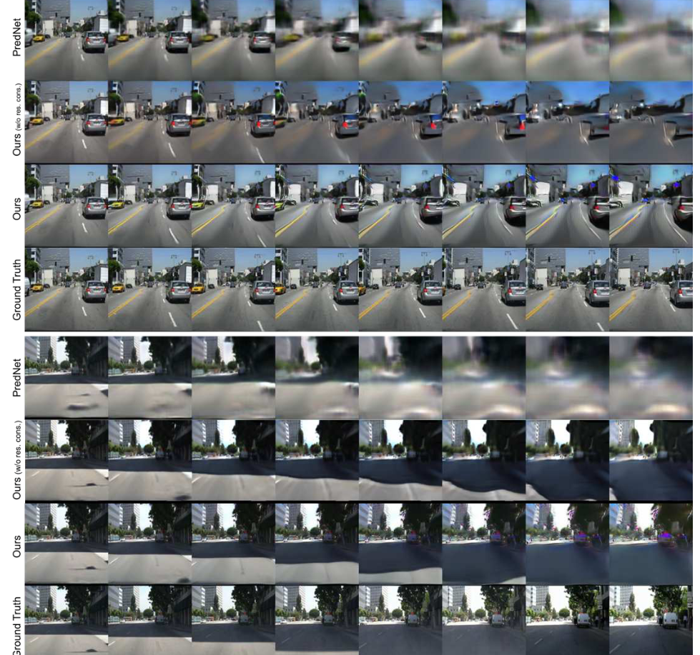

**Authors**: [Prakhar Gupta](https://www.linkedin.com/in/prakharkalyangupta/), [Mayuresh Bhosale](https://www.linkedin.com/in/mayuresh-bhosale-b6b935136/)

This work is the capstone project for the graduate course CPSC8810: ML for Image Synthesis by Dr. Siyu Huang at Clemson University. 

<!-- [About Me](/_pages/about/) -->

We build upon the ideas from [Retrospective Cycle GAN](https://openaccess.thecvf.com/content_CVPR_2019/papers/Kwon_Predicting_Future_Frames_Using_Retrospective_Cycle_GAN_CVPR_2019_paper.pdf) and ask the following quesiton: "Can we improve blurring in longer term predictions through the use of physics constraints?"

### Motivaiton & Key Idea

Kwon et al established great performance compared to the SOTA with their forward and backward temporal consistency idea for training the generator. They use two discriminators - one for image frame reconstruction and one for image sequence temporal consistency. However, they do not consider any conditionong on physics or restrict the movement of pixels expicitly. As shown below form their 
<!--  -->

  
   
  <em>Figure 1: This image from Kwon et al (2019) shows the blurring in longer term predicitons and distortions. Even though they outperform PredNet, it has room for improvement.</em>

<figure class="image-caption">
    
    <figcaption>Figure 1: This image from Kwon et al (2019) shows the blurring in longer term predicitons and distortions. Even though they outperform PredNet, it has room for improvement.</figcaption>
</figure>

#### RCGAN baseline model

### Project Demo

### Project Insights and Conclusions
