**Authors**: [Prakhar Gupta](https://www.linkedin.com/in/prakharkalyangupta/), [Mayuresh Bhosale](https://www.linkedin.com/in/mayuresh-bhosale-b6b935136/)

This work is the capstone project for the graduate course CPSC8810: ML for Image Synthesis by Dr. Siyu Huang at Clemson University. 

<!-- [About Me](/_pages/about/) -->

### Motivation & Key Idea

We build upon the ideas from [Retrospective Cycle GAN (Kwon et al)](https://openaccess.thecvf.com/content_CVPR_2019/papers/Kwon_Predicting_Future_Frames_Using_Retrospective_Cycle_GAN_CVPR_2019_paper.pdf). They established great performance compared to the SOTA with their forward and backward temporal consistency idea for training the generator. However, they do not consider any conditionong on physics or restrict the movement of pixels expicitly
<!--  -->

  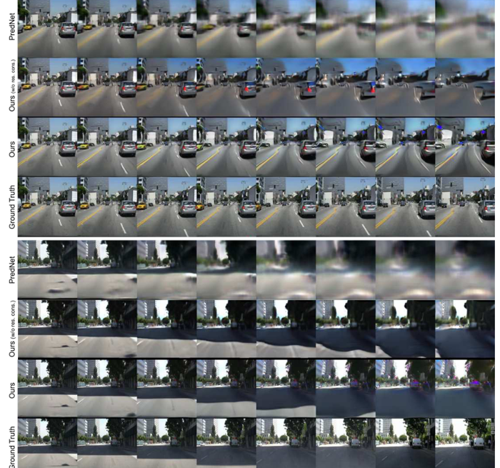
   
  <em>Figure 1: This image from Kwon et al (2019) shows the blurring in longer term predicitons and distortions. Even though they outperform PredNet, it has room for improvement.</em>

We ask the following quesiton: **"Can we improve blurring in longer term predictions through the use of physics constraints?"**

#### RCGAN baseline model
They use two discriminators - one for image frame reconstruction and one for image sequence temporal consistency. The loss function in the baseline model is given by :

  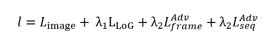

<h2 class="custom-heading">RCGAN baseline model</h2>

#### Optical Flow Conditioned RCGAN
To restrict pixel movement to realistic areas indirectly, we exploit [RAFT, Teed et al](https://arxiv.org/abs/2003.12039) pre-trained optical flow model to condition generations on optical flow loss. 

  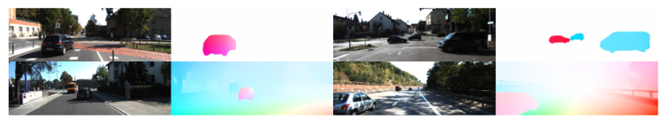
   
  <em>Optical flow detection perormance on KITTI dataset has been well estbalished by the Teed et al.</em>

The new loss function is designed as:

  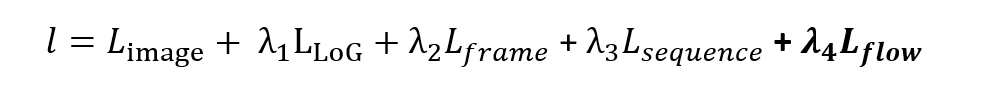

#### Kinematics Constraint Flow Conditioned RCGAN

The new loss function is designed as:

  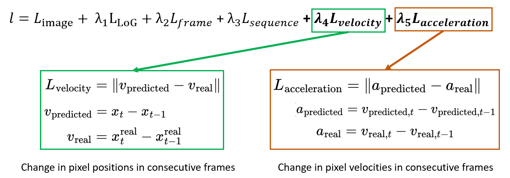

#### Combined Contstraints Conditioned RCGAN

### Project Results

We trained the conditional GAN on KITTI dataset city driving frame sequences of length 5. The models were evaluated on ~70 test sequences. Results belows show the performance of 3 models at different training epoch numbers for 2 chosen test sequences

Epoch 10:

  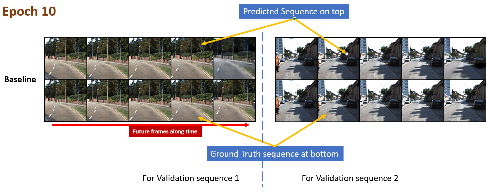

  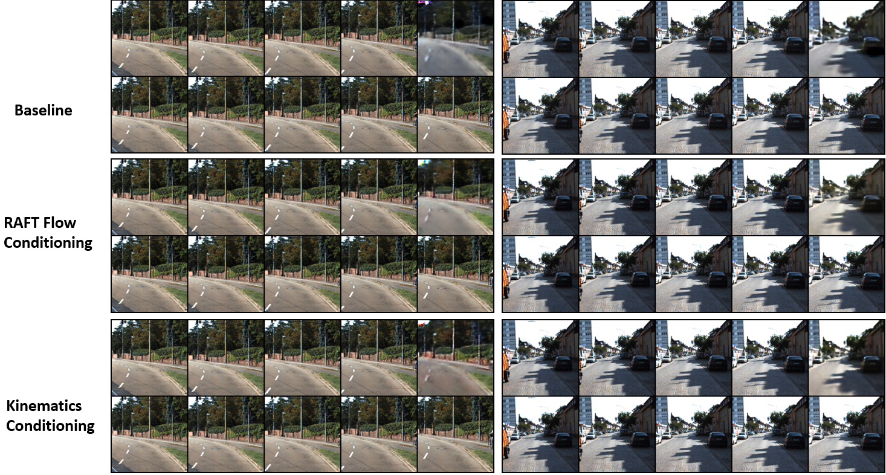

  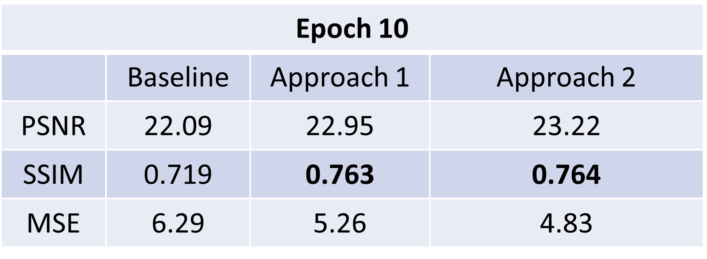

Epoch 30:

  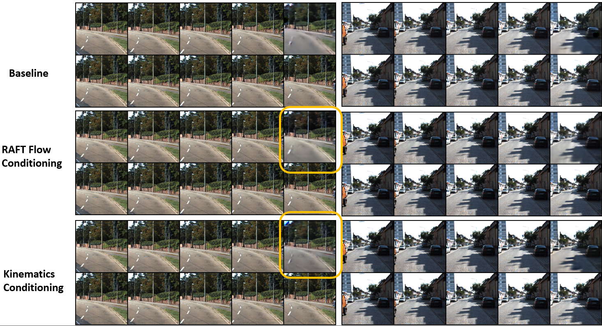

Epoch 50:

  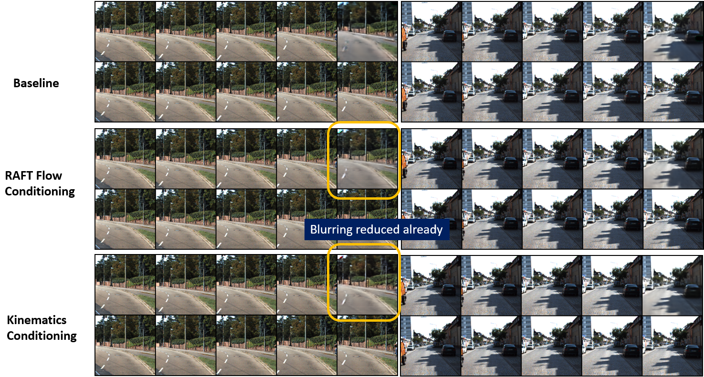

Epoch 100:

  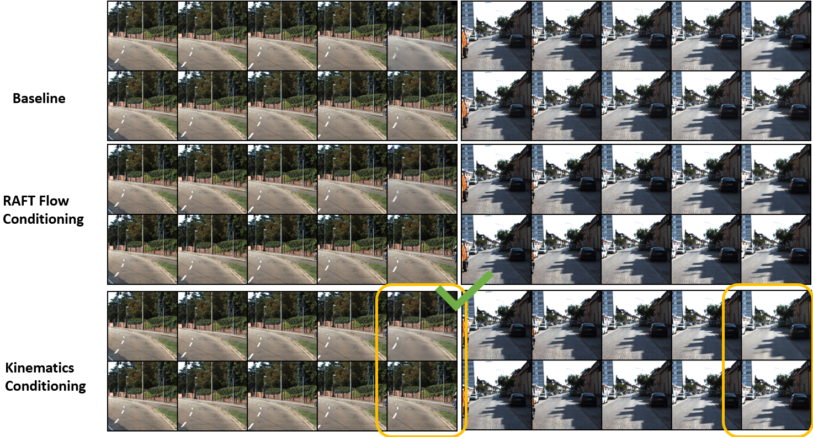

  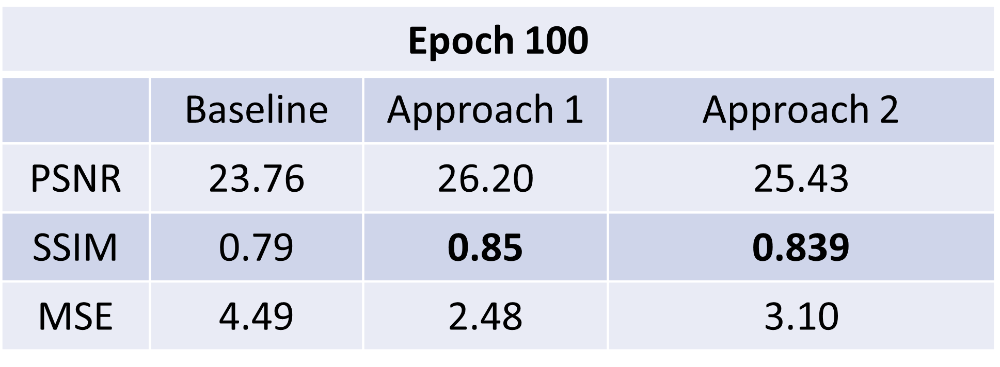

### Project Insights and Conclusions

  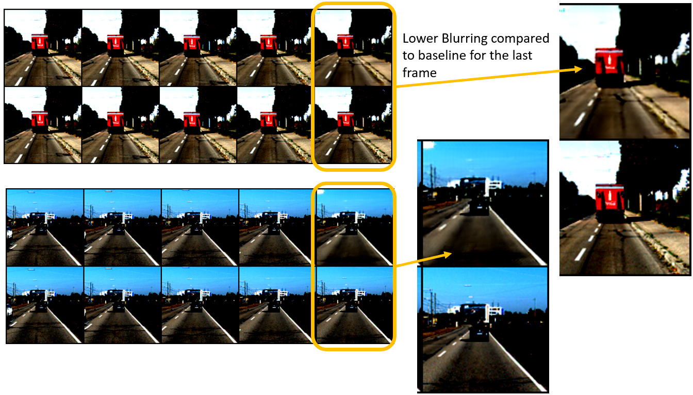

