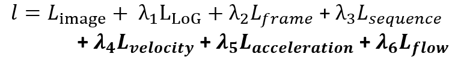
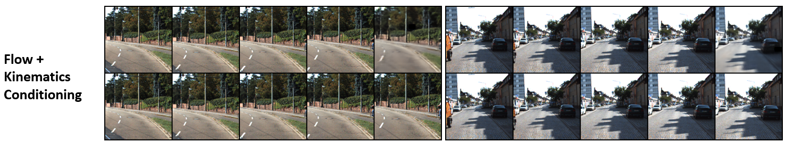
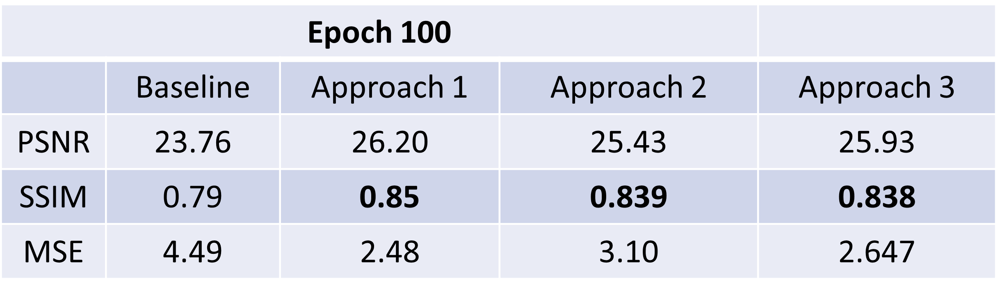

**Authors**: [Prakhar Gupta](https://www.linkedin.com/in/prakharkalyangupta/), [Mayuresh Bhosale](https://www.linkedin.com/in/mayuresh-bhosale-b6b935136/)

**Institution**: Clemson University

**Project Report**: [Report Paper](/assets/files/report.pdf), [PPT](/assets/files/cond_rcgan.pptx)

**Course Name**: CPSC8810 ML for Image Synthesis, Dr. Siyu Huang

<!-- [About Me](/_pages/about/) -->

<h2 style="color: brown; text-align: center;">Motivation & Key Idea</h2>

We build upon the ideas from [Retrospective Cycle GAN (Kwon et al)](https://openaccess.thecvf.com/content_CVPR_2019/papers/Kwon_Predicting_Future_Frames_Using_Retrospective_Cycle_GAN_CVPR_2019_paper.pdf). They established great performance compared to the SOTA with their forward and backward temporal consistency idea for training the generator. However, they do not consider any conditionong on physics or restrict the movement of pixels expicitly
<!--  -->

  
   
  <em>Figure 1: This image from Kwon et al (2019) shows the blurring in longer term predicitons and distortions. Even though they outperform PredNet, it has room for improvement.</em>

We ask the following quesiton: **"Can we improve blurring in longer term predictions through the use of physics constraints?"**

<h2 style="color: brown; text-align: center;">Formulation</h2>

<h3 style="color: blue;">RCGAN baseline model</h3>

They use two discriminators - one for image frame reconstruction and one for image sequence temporal consistency. The loss function in the baseline model is given by :

  

<h3 style="color: blue;"> Optical Flow Conditioned RCGAN</h3>

To restrict pixel movement to realistic areas indirectly, we exploit [RAFT, Teed et al](https://arxiv.org/abs/2003.12039) pre-trained optical flow model to condition generations on optical flow loss. 

  
   
  <em>Figure 2: Optical flow detection perormance on KITTI dataset has been well estbalished by the Teed et al.</em>

The new loss function is designed as:

  

<h3 style="color: blue;"> Kinematics Constraint Flow Conditioned RCGAN</h3>

The new loss function is designed as:

  

<h3 style="color: blue;"> Combined Contstraints Conditioned RCGAN</h3>

  

<h2 style="color: brown; text-align: center;"> Project Results</h2>

We trained the conditional GAN on KITTI dataset city driving frame sequences of length 5. The models were evaluated on ~70 test sequences. Results belows show the performance of 3 models at different training epoch numbers for 2 chosen test sequences

<h3 style="color: blue;">Epoch 10</h3>

  

  

  

<h3 style="color: blue;">Epoch 30</h3>

  

<h3 style="color: blue;">Epoch 50</h3>
At epoch 50 of trianing, the blurring in kinematics conditioned RCGAN is already starting to improve above the baseline and approach-1 models.

  

<h3 style="color: blue;">Epoch 100</h3>

Here, the kinematic conditioning approach clearly outperforms all others. We also explore the combined flow and kinemtatics conditioning of GAN. We notice that the expansion of scalar multi variable loss function demands more trianing to improve blurring. But the statistical metric of PSNR, SSIM and MSE are most promising.

  

  

  

Some more details for different test frames from Kinematics conditioned approach:

  

<h2 style="color: brown; text-align: center;">Project Insights and Conclusions</h2>

We develop a conditional GAN model to restrict pixel movements to realistic ones using optical flow or kinematic velocity constraints. This helps reducing some blurring over the baseline model. 
This is also the first step towards differential eqn based physics conditioning of the GAN model that utilizes object pixel tracking.
